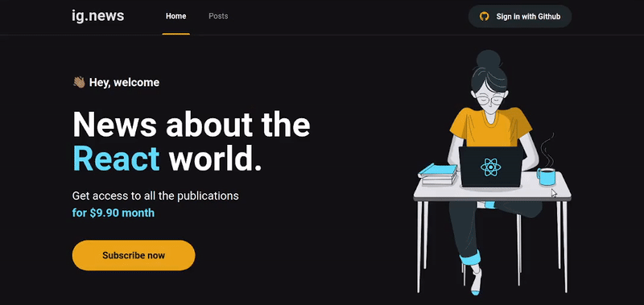

<br>

<p align="center">
  <a href="https://rocketseat.com.br">
    
  </a>
  
  <a href="https://www.linkedin.com/in/savio-lopes/">
    
  </a>
</p>

<br>

## :rocket: Sobre

<br>

<p align="center">
  
</p>

<br>

:memo: O projeto consiste num blog utilizando a API do [Stripe](https://stripe.com/) para o controle de pagamento e salvando os dados no FaunaDB, desenvolvido durante a trilha React da Ignite, disponibilizado pela [Rocketseat](https://rocketseat.com.br/).

## 🚀 Como executar o projeto

### Pré-requisitos

Antes de começar, você vai precisar ter instalado em sua máquina as seguintes ferramentas:
[Git](https://git-scm.com), [Node.js](https://nodejs.org/en/) e o gerenciador de pacotes [Yarn](https://yarnpkg.com).
Além disto é bom ter um editor para trabalhar com o código como [VSCode](https://code.visualstudio.com/)

<br>

#### 🧭 Rodando a aplicação

```bash
# Clone este repositório
$ git clone https://github.com/savio-2-lopes/Ig.News


# Crie um arquivo .env.local e configure as váriaveis de ambiente

# Stripe
STRIPE_API_KEY=
NEXT_PUBLIC_STRIPE_PUBLIC_KEY=
STRIPE_API_PRICE_KEY=
STRIPE_WEBHOOK_SECRET=
STRIPE_SUCESS_URL=
STRIPE_CANCEL_URL=

# Github
GITHUB_CLIENT_ID=
GITHUB_CLIENT_SECRET=

# FaunaDB
FAUNADB_KEY=

# Prismic CMS
PRISMIC_ENDPOINT=
PRISMIC_ACCESS_TOKEN=

# Acesse a pasta

$ cd Ig.News

# Instale as dependências

$ yarn

# Rode a aplicação

$ yarn dev

# Acesse http://localhost:3000 no seu navegador

```

<br>

## :computer: Tecnologias

Este projeto foi feito utilizando as seguintes tecnologias:

- [React](https://reactjs.org/)
- [Typescript](https://www.typescriptlang.org/)
- [NextJS](https://nextjs.org/)
- [FaunaDB](https://fauna.com/)'
- [Axios](https://github.com/axios/axios)
- [Prismic](https://prismic.io/)
- [Stripe](https://stripe.com/)
- [Sass](https://sass-lang.com/)
- [ESLint](https://eslint.org/)
- [Prettier](https://prettier.io/)

<br>

## :memo: Licença

Esse projeto está sob a licença MIT. Veja o arquivo [LICENSE](/LICENSE) para mais detalhes.

<br>

## :man_technologist: Autor

[](https://github.com/savio-2-lopes)
[](https://www.instagram.com/savioaugulopes/)
[](https://www.linkedin.com/in/savio-lopes/)
[](mailto:savio.dev.lopes@gmail.com)

Feito com ❤️ por Savio Lopes 👋🏽 [Entre em contato!](https://www.linkedin.com/in/savio-lopes/)

<br>

## 💙 Agradecimentos

Meus agradecimentos à [Rocketseat](https://rocketseat.com.br/) por disponibilizar esse conteúdo sensacional 🚀.
